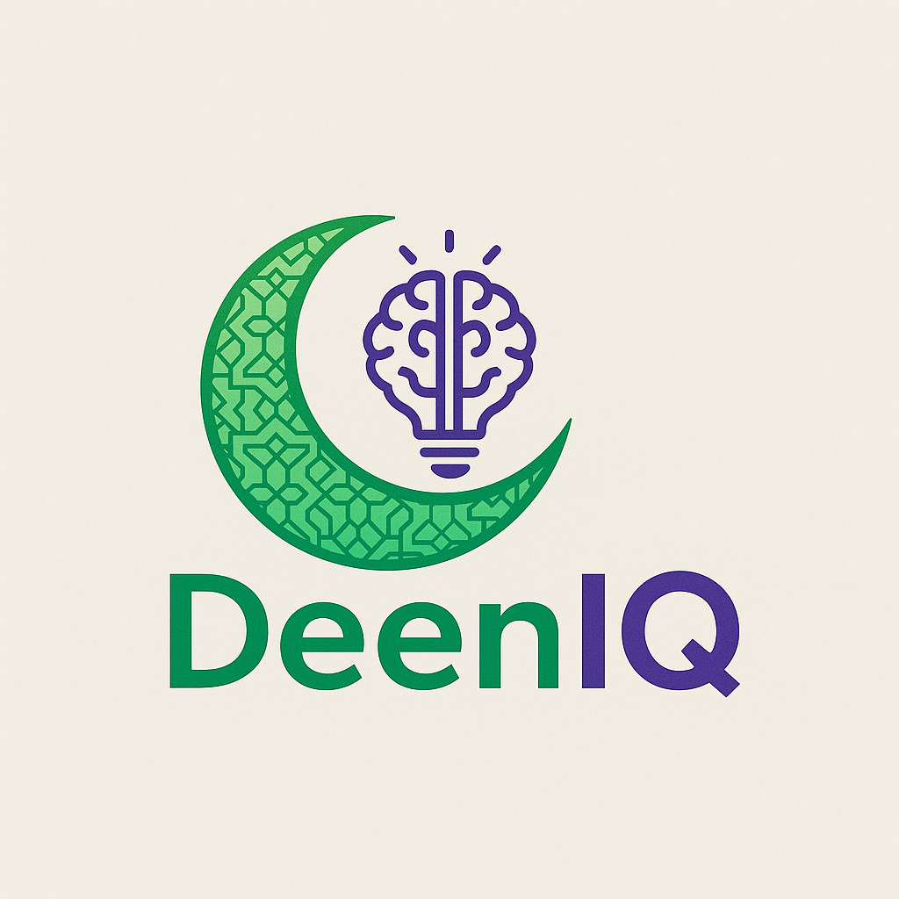

  

<h1 align="center">DeenIQ</h1>

  🌙🧠 Your intelligent Islamic companion for learning, answers, and deeper understanding of Deen.

---

## 🚀 What is DeenIQ?

**DeenIQ** is an AI-powered platform built to answer Islamic questions with authentic references from the **Qur’an**, **Hadith**, and classical scholarship — all with the power of modern AI.

Think of it as a thoughtful, respectful, and trusted AI guide that speaks with **clarity**, **proof**, and **care** — now with a **Voice Agent** coming soon to let you speak your questions.

---

## 🧩 Features

- ✅ **Ask any Islamic question** – in natural language
- 🧠 **AI understands the context** of Fiqh, Aqeedah, Hadith, and more
- 📖 **Backed with Qur’an and Sahih Hadith references**
- 🗣️ **Voice Agent (coming soon)** – Ask DeenIQ by speaking, not typing
- 🗂️ **Conversation history**
- 🌗 **Light and dark mode**
- 🔐 **JWT-based user authentication (register, login, logout)**
- 🌍 **Future**: Voice agent Multilingual support (Arabic, Somali, Urdu, English...)

---

## 🛠️ Tech Stack

| Layer        | Tech In Use                          |
| ------------ | ---------------------------------- |
| Frontend     | HTML, CSS, JavaScript (coming soon) |
| Backend      | Django REST Framework + JWT Auth  |
| AI Engine    | ChatGPT API (OpenAI), Quran.com API, Hadith API |
| Voice Agent  | Web Speech API (planned)           |
| Database     | SQLite (dev) → PostgreSQL (prod)   |
| Deployment   | Render / Vercel (planned)          |

